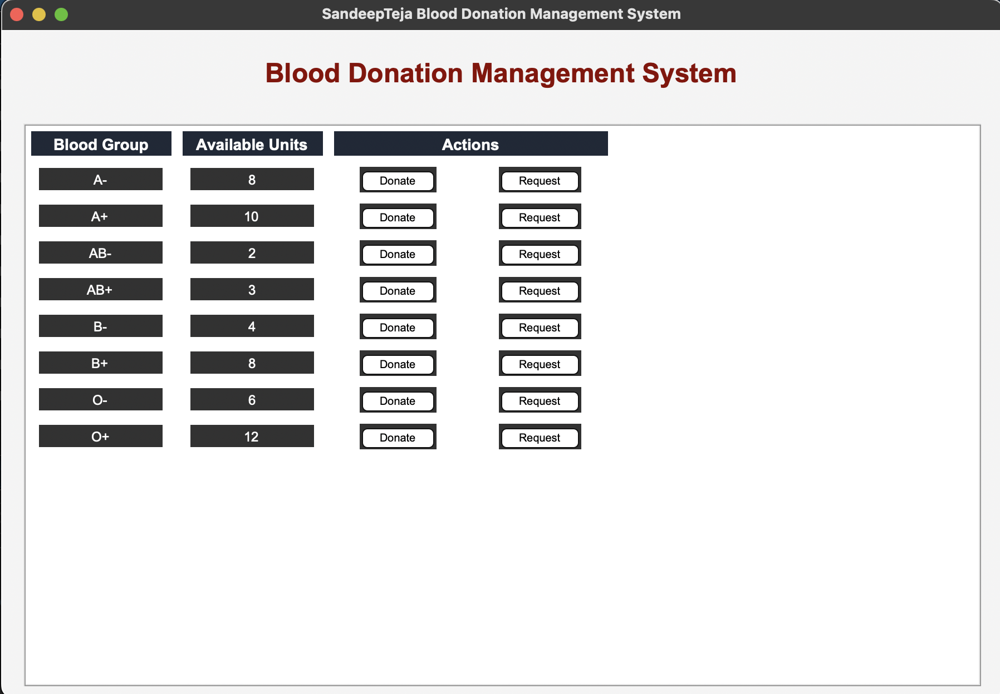
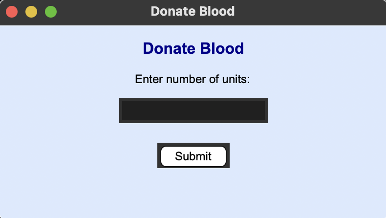
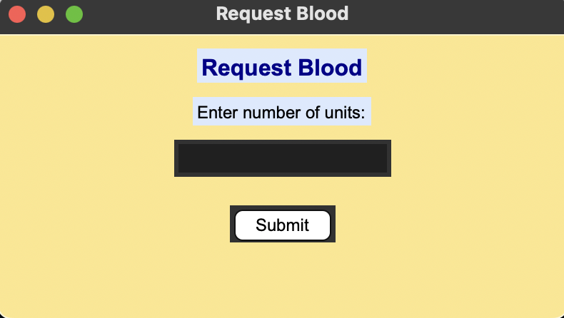

# **Blood Donation Management System**
**Author:** Sundara SandeepTeja

A simple and user-friendly **Blood Donation Management System** built using **Python (Tkinter GUI)** and **MySQL** to help manage blood inventory effectively. This system allows users to **donate** or **request** blood units for different blood groups and keeps the database updated in real-time.

---

## **Features**

- View available blood units for all blood groups
- Donate blood and update the stock instantly
- Request blood and decrease the stock safely
- Automatic refresh of data on the GUI
- Popup handling to avoid duplicate windows
- Clean, beginner-friendly code with comments
- Attractive and responsive GUI using `Tkinter`

---

## **Screenshots**

### Main Application Interface


### Donate Blood Popup


### Request Blood Popup


*Clean, responsive, and user-friendly GUI built with Tkinter*

---

## **Technologies Used**

| Technology  | Purpose                     |
|-------------|-----------------------------|
| Python      | Backend & GUI logic         |
| Tkinter     | Graphical User Interface    |
| MySQL       | Database for blood records  |
| mysql-connector-python | Database connectivity |

---

## **Database Structure**

Database Name: `db`  
Table Name: `BloodBank`

| Blood_Grp | Units |
|-----------|-------|
| A+        | 10    |
| B+        | 5     |
| ...       | ...   |

> Ensure your database and table are created before running the project.  

Sample SQL to create table:

```sql
CREATE DATABASE db;

USE db;

CREATE TABLE BloodBank (
    Blood_Grp VARCHAR(5) PRIMARY KEY,
    units INT DEFAULT 0
);

-- Insert initial data
INSERT INTO BloodBank (Blood_Grp, units) VALUES
('A+', 10), ('A-', 5),
('B+', 8), ('B-', 4),
('AB+', 6), ('AB-', 3),
('O+', 12), ('O-', 7);
```

## **How to Run**

1. **Clone this repository**:
   ```bash
   git clone https://github.com/Sandetej/Python-Projects.git
   cd Blood-Management-system
   ```

2. **Install required library** (if not already installed):
    ```bash
    pip install mysql-connector-python
    ```

3. **Start your MySQL server**

4. **Run the script**:
    ```bash
    python blood-donation.py
    ```

5. **Interact with the GUI** – Donate or Request blood!

## **Project Structure**

Blood-management-system/
│
├── blood_donation.py    # Main application
├── screenshots/                # UI images for README
└── README.md                   # Project documentation


